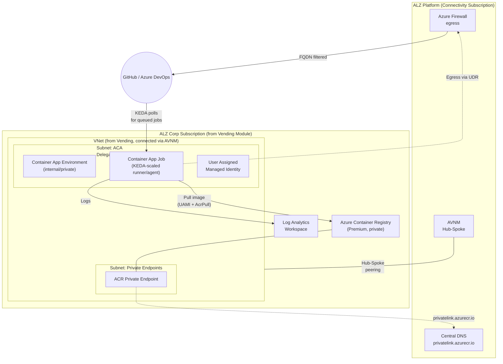

# Self-Hosted CI/CD Runners for Azure Landing Zone Corp

ALZ Corp subscriptions route all traffic through a central Azure Firewall and have no public IPs. The upstream [AVM CI/CD pattern module](https://github.com/Azure/terraform-azurerm-avm-ptn-cicd-agents-and-runners) creates its own VNet, NAT Gateway, and Public IP, which conflicts with that setup.

This module removes those networking components and deploys self-hosted **GitHub Actions Runners** or **Azure DevOps Agents** on **Azure Container Apps**, using the VNet and subnets your landing zone already provides.

Works with:

- [ALZ Terraform Modules](https://github.com/Azure/terraform-azurerm-caf-enterprise-scale) for platform landing zone
- [ALZ Vending Module](https://github.com/Azure/terraform-azurerm-lz-vending) for subscription vending (provides Resource Group, VNet, subnets)
- [Azure Virtual Network Manager (AVNM)](https://learn.microsoft.com/azure/virtual-network-manager/overview) for hub-spoke connectivity
- Azure Firewall for central egress (see [EGRESS.md](./EGRESS.md))

> Forked from [Azure/terraform-azurerm-avm-ptn-cicd-agents-and-runners](https://github.com/Azure/terraform-azurerm-avm-ptn-cicd-agents-and-runners) and adapted for ALZ Corp.

---


## Network egress requirements

Force-tunneled landing-zone spokes must allow the runner dependencies documented in [EGRESS.md](./EGRESS.md) at the hub Azure Firewall before deployment.

## Prerequisites

This module consumes networking from the surrounding landing zone and expects the platform to provide:

- **Subnets with a Network Security Group.** The `container_app_subnet_id` (delegated to `Microsoft.App/environments`) and `container_registry_private_endpoint_subnet_id` you pass in must already exist. Many landing zones enforce an Azure Policy that denies subnets without an NSG, so ensure the subnets you supply have one attached.
- **Private DNS for the container registry.** The module creates a Premium Azure Container Registry with public network access disabled and reaches it through a private endpoint. The Container App Job pulls its runner image from that registry over the private endpoint, so `privatelink.azurecr.io` must resolve to the private endpoint. Supply the zone with `container_registry_dns_zone_id`, or rely on a centrally managed private DNS zone (for example linked by Azure Policy). Without it the job fails to start with `unable to pull image`.

## Quick Start

### Version pinning

Pin consumers to the release tag so runner bootstrap behavior is reproducible:

```hcl
module "corp_runners" {
  source = "github.com/martinopedal/terraform-azurerm-github-runners-alz-corp?ref=v1.0.0"

  # ...
}
```

Minimal example: GitHub runners with PAT auth in an ALZ Corp subscription.

```hcl
module "github_runners" {
  source = "github.com/martinopedal/terraform-azurerm-github-runners-alz-corp?ref=v1.0.0"

  postfix  = "ghrun"
  location = "swedencentral"

  # Subnets from ALZ Vending Module
  container_app_subnet_id                      = module.lz_vending.subnets["aca"].id
  container_registry_private_endpoint_subnet_id = module.lz_vending.subnets["pe"].id

  # GitHub
  version_control_system_type                  = "github"
  version_control_system_organization          = "my-org"
  version_control_system_repository            = "my-repo"
  version_control_system_personal_access_token = var.github_pat
}
```

Then reference the runner in your workflow:

```yaml
jobs:
  deploy:
    runs-on: self-hosted
    steps:
      - uses: actions/checkout@v4
      - run: terraform plan
```

See [Usage examples](#usage---github-runners-with-pat) below for GitHub App auth, Azure DevOps PAT, and Azure DevOps UAMI.

---

## Quick Start: webhook-driven scaling

For sub-second scale-up with **no GitHub/AzDO API polling**, enable webhook mode. KEDA scales on a private Storage Queue fed by a webhook receiver you host (Function / Logic App / APIM).

```hcl
module "github_runners" {
  source = "github.com/martinopedal/terraform-azurerm-github-runners-alz-corp?ref=v1.0.0"

  postfix  = "ghrun"
  location = "swedencentral"

  container_app_subnet_id                       = module.lz_vending.subnets["aca"].id
  container_registry_private_endpoint_subnet_id = module.lz_vending.subnets["pe"].id

  version_control_system_type                  = "github"
  version_control_system_organization          = "my-org"
  version_control_system_repository            = "my-repo"
  version_control_system_personal_access_token = var.github_pat

  # Webhook-driven scaling
  webhook_scaling_enabled                  = true
  webhook_storage_private_endpoint_subnet_id = module.lz_vending.subnets["pe"].id
  webhook_storage_queue_dns_zone_id        = azurerm_private_dns_zone.queue.id
  webhook_receiver_principal_ids = [
    azurerm_user_assigned_identity.webhook_receiver.principal_id,
  ]
}
```

**Prerequisites (caller-supplied):**
- Subnet for the Storage Account private endpoint (can reuse the ACR PE subnet).
- Private DNS zone `privatelink.queue.core.windows.net` (or central DNS / Azure Policy).
- A webhook receiver with a managed identity. The module grants it `Storage Queue Data Message Sender` on the queue.
- `storage_use_azuread = true` on the `azurerm` provider block. The Storage Account is created with `shared_access_key_enabled = false` and the AVM submodule's queue resource talks Storage data-plane during apply - without this flag the provider falls back to shared-key auth and the apply fails with `KeyBasedAuthenticationNotPermitted`. See [WEBHOOKS.md](./WEBHOOKS.md#caller-prerequisites-required-when-webhook_scaling_enabled--true) for the full prereq list including the data-plane RBAC role.

**Receiver contract:** see [WEBHOOKS.md](./WEBHOOKS.md) for payload shape, idempotency rules, and a sample Azure Function.

**Two-phase apply, known issue:** the upstream storage AVM submodule has a `count`-on-unknown bug when the private DNS zone ID is computed in the same plan. If you hit `The "count" value depends on resource attributes that cannot be determined until apply`, run a targeted apply for the network prerequisites first:

```powershell
terraform apply -target=azurerm_virtual_network.this -target=azurerm_subnet.aca -target=azurerm_subnet.pe -target=azurerm_private_dns_zone.queue -target=azurerm_private_dns_zone.acr
terraform apply
```

**Post-deploy verification:**

```powershell
az containerapp job show -g <rg> -n cj-ghrun --query "properties.configuration | {trigger:triggerType, rules:eventTriggerConfig.scale.rules[].{name:name, type:type, queue:metadata.queueName, account:metadata.accountName, identity:identity}}"
```

Expect `triggerType=Event`, scaler `azure-queue`, identity is the runner UAMI resource ID, `queueName=runner-jobs`.

End-to-end working example: [`examples/github_runners_webhook/`](./examples/github_runners_webhook/).

---

## ALZ Provides vs. This Module Creates

| Resource | ALZ / Platform team | This module |
|---|---|---|
| Virtual Network + Subnets | Yes (Vending Module) | No |
| Hub-spoke connectivity | Yes (AVNM) | No |
| Azure Firewall + egress rules | Yes (Platform team, see [FIREWALL-RULES.md](./FIREWALL-RULES.md)) | No |
| Private DNS for `privatelink.azurecr.io` | Yes (central DNS or Azure Policy) | No |
| NAT Gateway / Public IP | Not needed | Not created |
| Resource Group | Optional (Vending Module can provide) | Yes (optional) |
| Azure Container Registry (Premium, private) | N/A | Yes |
| Container App Environment (internal) | N/A | Yes |
| Container App Job (KEDA-scaled) | N/A | Yes |
| User Assigned Managed Identity | N/A | Yes |
| Log Analytics Workspace | N/A | Yes |

---

## Authentication

This module involves **two separate authentication layers** that serve different purposes.
These are frequently confused, so this section explains each one.

### Layer 1: Terraform to Azure (Infrastructure Deployment)

**"How does Terraform authenticate to Azure to create the resources?"**

This is handled **outside this module** in your CI/CD pipeline or local environment:

| Method | When to Use | How |
|---|---|---|
| **Workload Identity Federation (OIDC)** | CI/CD pipelines (recommended) | `ARM_CLIENT_ID` + `ARM_TENANT_ID` + `ARM_SUBSCRIPTION_ID` + `ARM_OIDC_TOKEN`/`ARM_OIDC_REQUEST_*` |
| **Service Principal + Client Secret** | CI/CD pipelines (legacy) | `ARM_CLIENT_ID` + `ARM_CLIENT_SECRET` + `ARM_TENANT_ID` + `ARM_SUBSCRIPTION_ID` |
| **Managed Identity** | Azure-hosted deployment agents | `ARM_USE_MSI = true` |
| **Azure CLI** | Local development | `az login` before `terraform apply` |

> **This module does NOT configure Terraform authentication.** That's your pipeline's responsibility.

### Layer 2: Runner/Agent to VCS Platform (Runtime Registration)

**"How does the self-hosted runner authenticate to GitHub/Azure DevOps to pick up jobs?"**

This is what `version_control_system_authentication_method` configures. The runner container
uses these credentials **at runtime** to register itself and poll for jobs:

#### GitHub Options

| Method | Variable | How It Works |
|---|---|---|
| **PAT** | `version_control_system_personal_access_token` | A GitHub Personal Access Token (classic with `repo` + `admin:org` scopes, or fine-grained equivalent). Stored as a Container App secret. The KEDA scaler also uses it to poll for queued workflows. |
| **GitHub App** | `version_control_system_github_application_id` + `_installation_id` + `_key` | A GitHub App installed on your org/repo. The runner uses the App's private key to generate short-lived tokens. No long-lived token, scoped permissions, audit trail. Preferred for production. |

#### Azure DevOps Options

| Method | Variable | How It Works |
|---|---|---|
| **PAT** | `version_control_system_personal_access_token` | An Azure DevOps PAT with `Agent Pools (Read & manage)` scope. Stored as a Container App secret. Used by both the agent and the KEDA scaler. |
| **UAMI** | (No token needed) | A User Assigned Managed Identity registered as a service principal in Azure DevOps with Administrator role on the target agent pool. No secrets to manage or rotate. The agent uses the managed identity to obtain tokens from Entra ID. |

### Layer 3: Runner/Agent UAMI to Azure Resources (Workload Access)

**"How does the runner access Azure resources (Storage, Key Vault, etc.) during job execution?"**

The User Assigned Managed Identity (UAMI) created by this module is attached to the Container App Job.
Your workflow steps can use this identity to authenticate to Azure resources without secrets:

```yaml
# GitHub Actions example
- uses: azure/login@v2
  with:
    client-id: ${{ secrets.UAMI_CLIENT_ID }}
    tenant-id: ${{ secrets.AZURE_TENANT_ID }}
    subscription-id: ${{ secrets.AZURE_SUBSCRIPTION_ID }}
```

Grant the UAMI appropriate RBAC roles on the resources your pipelines need to access.

---

## Architecture



---

## Prerequisites

1. **ALZ Vending Module** must have provisioned:
   - A subscription with a VNet connected to the hub via AVNM
   - A subnet delegated to `Microsoft.App/environments` (min /27 recommended)
   - A subnet for private endpoints (ACR)

2. **Azure Firewall** must allow the FQDNs listed in [FIREWALL-RULES.md](./FIREWALL-RULES.md)

3. **Private DNS** for `privatelink.azurecr.io` must resolve (via central DNS or Azure Policy)

4. **`Microsoft.App` resource provider** must be registered on the subscription

---

## Usage - GitHub Runners with PAT

```hcl
module "github_runners" {
  source = "github.com/martinopedal/terraform-azurerm-github-runners-alz-corp?ref=v1.0.0"

  postfix  = "ghrun"
  location = "swedencentral"

  # ALZ Corp networking (from Vending Module outputs)
  container_app_subnet_id                    = module.lz_vending.subnets["aca"].id
  container_registry_private_endpoint_subnet_id = module.lz_vending.subnets["pe"].id
  container_registry_dns_zone_id             = data.azurerm_private_dns_zone.acr.id  # or null if policy-managed

  # GitHub configuration
  version_control_system_type                  = "github"
  version_control_system_organization          = "my-org"
  version_control_system_repository            = "my-repo"
  version_control_system_authentication_method = "pat"
  version_control_system_personal_access_token = var.github_pat  # from Key Vault or pipeline secret

  tags = var.tags
}
```

Then in your GitHub Actions workflow:

```yaml
jobs:
  deploy:
    runs-on: self-hosted
    steps:
      - uses: actions/checkout@v4
      - run: echo "Running on self-hosted runner"
```

## Usage - Azure DevOps Agents with UAMI

```hcl
module "azuredevops_agents" {
  source = "github.com/martinopedal/terraform-azurerm-github-runners-alz-corp?ref=v1.0.0"

  postfix  = "adoagt"
  location = "swedencentral"

  # ALZ Corp networking
  container_app_subnet_id                    = module.lz_vending.subnets["aca"].id
  container_registry_private_endpoint_subnet_id = module.lz_vending.subnets["pe"].id

  # Azure DevOps configuration - UAMI (no PAT needed)
  version_control_system_type                  = "azuredevops"
  version_control_system_organization          = "https://dev.azure.com/my-org"
  version_control_system_pool_name             = "alz-corp-pool"
  version_control_system_authentication_method = "uami"

  # Pre-configured UAMI (must be registered in Azure DevOps first)
  user_assigned_managed_identity_creation_enabled = false
  user_assigned_managed_identity_id               = azurerm_user_assigned_identity.ado.id
  user_assigned_managed_identity_client_id        = azurerm_user_assigned_identity.ado.client_id
  user_assigned_managed_identity_principal_id     = azurerm_user_assigned_identity.ado.principal_id

  tags = var.tags
}
```

## Usage - GitHub Runners with GitHub App Auth

```hcl
module "github_runners" {
  source = "github.com/martinopedal/terraform-azurerm-github-runners-alz-corp?ref=v1.0.0"

  postfix  = "ghapp"
  location = "swedencentral"

  # ALZ Corp networking
  container_app_subnet_id                    = module.lz_vending.subnets["aca"].id
  container_registry_private_endpoint_subnet_id = module.lz_vending.subnets["pe"].id

  # GitHub App authentication (no long-lived PAT)
  version_control_system_type                               = "github"
  version_control_system_organization                       = "my-org"
  version_control_system_repository                         = "my-repo"
  version_control_system_authentication_method              = "github_app"
  version_control_system_github_application_id              = var.github_app_id
  version_control_system_github_application_installation_id = var.github_app_installation_id
  version_control_system_github_application_key             = var.github_app_private_key

  tags = var.tags
}
```

---

## How It Works

1. **Image Build** - ACR Task builds the runner/agent image from
   [Azure/avm-container-images-cicd-agents-and-runners](https://github.com/Azure/avm-container-images-cicd-agents-and-runners)
   (or your custom image)
2. **Idle** - Container App Job scales to zero. No runners running, no compute cost.
3. **Job Queued** - A workflow/pipeline is triggered in GitHub or Azure DevOps
4. **KEDA Scales Up** - The KEDA scaler starts an ephemeral Container App Job execution. By default this is the `github-runner` / `azure-pipelines` scaler **polling** the VCS API every `container_app_polling_interval_seconds`. For sub-second scale-up with no API polling, enable [webhook-driven scaling](./WEBHOOKS.md) (`webhook_scaling_enabled = true`). KEDA then scales on a private Storage Queue fed by your webhook receiver.
5. **Runner Registers** - The container registers as a runner/agent, picks up the job, runs it
6. **Runner Terminates** - After the job completes, the ephemeral container terminates
7. **Scale to Zero** - If no more jobs are queued, KEDA scales back down

---

## Scaling modes

| Mode | Trigger | Latency | API load | Extra moving parts |
|---|---|---|---|---|
| **Polling** (default) | KEDA polls GitHub/AzDO every 30s | 0-30s | Each runner counts against API rate limit | None |
| **Webhook** (`webhook_scaling_enabled = true`) | GitHub/AzDO webhook to your receiver to Storage Queue to KEDA `azure-queue` scaler | Queue poll interval | Zero polling against VCS | Storage Account + Queue (this module) plus a webhook receiver you host (Function/Logic App/APIM, out of module) |

Full details, receiver contract, and a sample Function in [WEBHOOKS.md](./WEBHOOKS.md).

---

## Runner labels (GitHub only)

By default, GitHub-hosted runners advertise the labels `self-hosted`, `Linux`, and `X64`. Workflows target them with `runs-on: self-hosted`. When you run multiple runner pools (e.g. one per team, one per repo, one per workload class) you usually want to give each pool a distinct label so workflows can pin to it with `runs-on: <label>`.

This module exposes two inputs:

| Variable | Type | Default | Effect |
|---|---|---|---|
| `version_control_system_runner_labels` | `list(string)` | `[]` | Extra labels added to the runner at registration. Also forwarded to the KEDA `github-runner` scaler so polling mode scales the right pool. |
| `version_control_system_runner_no_default_labels` | `bool` | `false` | Pass `--no-default-labels` to the runner. The defaults `self-hosted`/`Linux`/`X64` are dropped; only `version_control_system_runner_labels` remain. |

Both inputs are GitHub-only - setting them with `version_control_system_type = "azuredevops"` fails validation. Azure DevOps uses pools and demands instead.

Example: a dedicated runner pool for a single repo with its own label:

```hcl
module "github_runners_team_a" {
  source = "github.com/martinopedal/terraform-azurerm-github-runners-alz-corp?ref=v1.1.0"

  postfix  = "team-a"
  location = "swedencentral"

  container_app_subnet_id                       = module.lz_vending.subnets["aca"].id
  container_registry_private_endpoint_subnet_id = module.lz_vending.subnets["pe"].id

  version_control_system_type                  = "github"
  version_control_system_organization          = "my-org"
  version_control_system_repository            = "team-a-service"
  version_control_system_personal_access_token = var.github_pat

  version_control_system_runner_labels = ["team-a", "linux-x64"]
}
```

Workflow:

```yaml
jobs:
  build:
    runs-on: [self-hosted, team-a]
```

**Webhook mode note:** when `webhook_scaling_enabled = true` the KEDA scaler is `azure-queue` and ignores GitHub labels - scaling is driven entirely by the Storage Queue. The labels are still applied at runner registration, so `runs-on` matching still works as expected.

**Reserved env var names:** do not pass `LABELS` or `NO_DEFAULT_LABELS` via `container_app_environment_variables` when using these inputs - Azure Container Apps rejects duplicate environment variable names.

---

## Runner Image - What's Included (and What's Not)

The default image is **not** the same as GitHub's `ubuntu-latest` hosted runner. GitHub-hosted `ubuntu-latest` is ~80 GB with Docker, Node, Python, .NET, Java, Buildah, Chrome and dozens of other tools preinstalled. Self-hosted runners on Azure Container Apps use a minimal image instead.

The default image is built from [`Azure/avm-container-images-cicd-agents-and-runners`](https://github.com/Azure/avm-container-images-cicd-agents-and-runners) (`github-runner-aca` / `azure-devops-agent-aca`) and contains:

| Included | Not included |
|---|---|
| Base: `mcr.microsoft.com/azure-powershell:ubuntu-22.04` (at the pinned commit `9b4c292`) | ❌ Docker / `docker-ce-cli` |
| `git`, `curl`, `jq`, `unzip`, `ca-certificates` | ❌ Buildah, Kaniko, Podman |
| `nodejs`, `ruby` | ❌ Python, .NET SDK, Java, Go |
| `azure-cli`, PowerShell (`pwsh`) | ❌ Chrome, Firefox, browsers |
| GitHub Actions runner / Azure Pipelines agent binaries | ❌ Most things `ubuntu-latest` ships |

> The default image is pinned via `default_image_repository_commit` (currently `9b4c292`) and built with `default_image_registry_dockerfile_path = "Dockerfile"`. ACR Tasks run on a case-sensitive filesystem, so the path casing must match the upstream repo.

### Base image choice, why not Alpine?

Don't. The GitHub Actions runner and Azure Pipelines agent are built against **glibc**; Alpine uses **musl**. `actions/setup-node`, `setup-python`, `setup-dotnet` all ship glibc binaries and fail on Alpine with cryptic loader errors. Most Marketplace actions are Node-based and also break. The size win is fake once the runner payload is in. If you maintain a custom image, the sensible bases are Ubuntu 24.04, Debian 12-slim, or **Azure Linux 3.0** (`mcr.microsoft.com/azurelinux/base/core:3.0`): Microsoft-published, hardened, glibc, around 110 MB.

### Why no Docker?

Azure Container Apps Jobs run in a sandboxed environment that does not allow privileged containers, so traditional Docker-in-Docker (DinD) does not work. Workflow steps cannot `apt-get install docker.io` and then `docker build`. The daemon will not start.

### Pushing images to the private ACR

The container registry created by this module has `publicNetworkAccess = Disabled` and is reachable only via the Private Endpoint inside your VNet. The platform module stops there. Choosing a build pattern (dedicated ACR agent pool, in-runner Buildah, etc.) is a workflow concern handled separately.

Set `runner_acr_push_enabled = true` to grant the runner UAMI `AcrPush` on the registry, then wire the cookbook submodule alongside this module. The submodule follows the AVM Resource Module specification: you create the subnet, the module consumes it.

```hcl
module "runners" {
  source = "github.com/martinopedal/terraform-azurerm-github-runners-alz-corp?ref=v1.0.0"

  # ... your existing inputs ...
  runner_acr_push_enabled = true
}

resource "azurerm_subnet" "acr_agent_pool" {
  name                              = "snet-acragent"
  resource_group_name               = azurerm_virtual_network.this.resource_group_name
  virtual_network_name              = azurerm_virtual_network.this.name
  address_prefixes                  = ["10.0.3.0/24"]
  private_endpoint_network_policies = "Disabled"
}

module "acr_agent_pool" {
  source = "github.com/martinopedal/github-runners-alz-corp-cookbook//modules/acr-agent-pool"

  name                               = "vnetpool"
  location                           = "swedencentral"
  container_registry_resource_id     = module.runners.container_registry_resource_id
  virtual_network_subnet_resource_id = azurerm_subnet.acr_agent_pool.id
}
```

Companion cookbook: [`github-runners-alz-corp-cookbook`](https://github.com/martinopedal/github-runners-alz-corp-cookbook)

- TF submodule [`modules/acr-agent-pool`](https://github.com/martinopedal/github-runners-alz-corp-cookbook/tree/main/modules/acr-agent-pool) for the `az acr build` path (recommended).
- Pattern docs at [`patterns/acr-build.md`](https://github.com/martinopedal/github-runners-alz-corp-cookbook/blob/main/patterns/acr-build.md) covering both `az acr build` and in-runner Buildah.
- Drop-in [`workflows/container-build.yml`](https://github.com/martinopedal/github-runners-alz-corp-cookbook/blob/main/workflows/container-build.yml).

### Custom runner images

Build a custom runner image when you need extra tools (Docker CLI talking to a remote daemon, Buildah, Python, etc.). Extend the default image and pass it via `custom_container_registry_images` + `use_default_container_image = false`. See [`variables.container.registry.tf`](./variables.container.registry.tf).

If your customer needs `ubuntu-latest`-equivalent tooling, point them at GitHub-hosted runners, not self-hosted. Self-hosted is for jobs that need network access into the landing zone or specific tooling, not for replicating the full hosted-runner toolbox.

---

## Using the runners, workflow examples

Drop-in workflow files live under [`docs/workflow-examples/`](./docs/workflow-examples/):

- [`terraform-apply.yml`](./docs/workflow-examples/terraform-apply.yml): Terraform plan/apply using `ARM_USE_MSI=true` and the runner UAMI for Azure auth

Both authenticate to Azure via the runner's managed identity. No PATs or client secrets to manage.

---

## Examples

| Example | Description |
|---|---|
| [github_runners_pat](./examples/github_runners_pat/) | GitHub runners with PAT authentication |
| [github_runners_app_auth](./examples/github_runners_app_auth/) | GitHub runners with GitHub App authentication |
| [github_runners_webhook](./examples/github_runners_webhook/) | GitHub runners with webhook-driven scaling (Storage Queue + receiver) |
| [azuredevops_agents_pat](./examples/azuredevops_agents_pat/) | Azure DevOps agents with PAT authentication |
| [azuredevops_agents_uami](./examples/azuredevops_agents_uami/) | Azure DevOps agents with UAMI (no secrets) |

---

<!-- BEGIN_TF_DOCS -->
<!-- Code generated by terraform-docs. DO NOT EDIT. -->

<!-- markdownlint-disable MD033 -->
## Requirements

The following requirements are needed by this module:

- <a name="requirement_terraform"></a> [terraform](#requirement\_terraform) (>= 1.9.0)

- <a name="requirement_azapi"></a> [azapi](#requirement\_azapi) (~> 2.8)

- <a name="requirement_azurerm"></a> [azurerm](#requirement\_azurerm) (~> 4.20)

- <a name="requirement_modtm"></a> [modtm](#requirement\_modtm) (~> 0.3)

- <a name="requirement_random"></a> [random](#requirement\_random) (~> 3.5)

- <a name="requirement_time"></a> [time](#requirement\_time) (~> 0.12)

## Resources

The following resources are used by this module:

- [azapi_resource.custom_container_registry_pull](https://registry.terraform.io/providers/Azure/azapi/latest/docs/resources/resource) (resource)
- [azapi_resource.runner_acr_push](https://registry.terraform.io/providers/Azure/azapi/latest/docs/resources/resource) (resource)
- [azurerm_container_app_environment.this](https://registry.terraform.io/providers/hashicorp/azurerm/latest/docs/resources/container_app_environment) (resource)
- [azurerm_management_lock.this](https://registry.terraform.io/providers/hashicorp/azurerm/latest/docs/resources/management_lock) (resource)
- [azurerm_resource_group.this](https://registry.terraform.io/providers/hashicorp/azurerm/latest/docs/resources/resource_group) (resource)
- [modtm_telemetry.telemetry](https://registry.terraform.io/providers/azure/modtm/latest/docs/resources/telemetry) (resource)
- [random_uuid.telemetry](https://registry.terraform.io/providers/hashicorp/random/latest/docs/resources/uuid) (resource)
- [time_sleep.delay_after_container_app_environment_creation](https://registry.terraform.io/providers/hashicorp/time/latest/docs/resources/sleep) (resource)
- [time_sleep.delay_after_container_image_build](https://registry.terraform.io/providers/hashicorp/time/latest/docs/resources/sleep) (resource)
- [azapi_client_config.current](https://registry.terraform.io/providers/Azure/azapi/latest/docs/data-sources/client_config) (data source)
- [azapi_client_config.telemetry](https://registry.terraform.io/providers/Azure/azapi/latest/docs/data-sources/client_config) (data source)
- [azurerm_client_config.current](https://registry.terraform.io/providers/hashicorp/azurerm/latest/docs/data-sources/client_config) (data source)
- [modtm_module_source.telemetry](https://registry.terraform.io/providers/azure/modtm/latest/docs/data-sources/module_source) (data source)

<!-- markdownlint-disable MD013 -->
## Required Inputs

The following input variables are required:

### <a name="input_container_app_subnet_id"></a> [container\_app\_subnet\_id](#input\_container\_app\_subnet\_id)

Description: The resource ID of the subnet for the Container App Environment. Must have delegation for `Microsoft.App/environments`. Provided by ALZ Vending Module.

Type: `string`

### <a name="input_container_registry_private_endpoint_subnet_id"></a> [container\_registry\_private\_endpoint\_subnet\_id](#input\_container\_registry\_private\_endpoint\_subnet\_id)

Description: The resource ID of the subnet for the Container Registry private endpoint. Provided by ALZ Vending Module.

Type: `string`

### <a name="input_location"></a> [location](#input\_location)

Description: Azure region where the resource should be deployed.

Type: `string`

### <a name="input_postfix"></a> [postfix](#input\_postfix)

Description: A postfix used to build default names if no name has been supplied for a specific resource type.

Type: `string`

### <a name="input_version_control_system_organization"></a> [version\_control\_system\_organization](#input\_version\_control\_system\_organization)

Description: The organization for the version control system. For Azure DevOps: the full URL (e.g. `https://dev.azure.com/my-org`). For GitHub: the organization name.

Type: `string`

### <a name="input_version_control_system_type"></a> [version\_control\_system\_type](#input\_version\_control\_system\_type)

Description: The type of the version control system. Allowed values are `azuredevops` or `github`.

Type: `string`

## Optional Inputs

The following input variables are optional (have default values):

### <a name="input_container_app_container_cpu"></a> [container\_app\_container\_cpu](#input\_container\_app\_container\_cpu)

Description: Required CPU in cores, e.g. 0.5

Type: `number`

Default: `1`

### <a name="input_container_app_container_memory"></a> [container\_app\_container\_memory](#input\_container\_app\_container\_memory)

Description: Required memory, e.g. '250Mb'

Type: `string`

Default: `"2Gi"`

### <a name="input_container_app_environment_creation_enabled"></a> [container\_app\_environment\_creation\_enabled](#input\_container\_app\_environment\_creation\_enabled)

Description: Whether or not to create a Container App Environment.

Type: `bool`

Default: `true`

### <a name="input_container_app_environment_id"></a> [container\_app\_environment\_id](#input\_container\_app\_environment\_id)

Description: The resource id of the Container App Environment. Only required if `container_app_environment_creation_enabled` is `false`.

Type: `string`

Default: `null`

### <a name="input_container_app_environment_name"></a> [container\_app\_environment\_name](#input\_container\_app\_environment\_name)

Description: The name of the Container App Environment. Only required if `container_app_environment_creation_enabled` is `true`.

Type: `string`

Default: `null`

### <a name="input_container_app_environment_variables"></a> [container\_app\_environment\_variables](#input\_container\_app\_environment\_variables)

Description: List of additional environment variables to pass to the container.

Type:

```hcl
set(object({
    name  = string
    value = string
  }))
```

Default: `[]`

### <a name="input_container_app_infrastructure_resource_group_name"></a> [container\_app\_infrastructure\_resource\_group\_name](#input\_container\_app\_infrastructure\_resource\_group\_name)

Description: The name of the resource group where the Container Apps infrastructure is deployed.

Type: `string`

Default: `null`

### <a name="input_container_app_job_container_name"></a> [container\_app\_job\_container\_name](#input\_container\_app\_job\_container\_name)

Description: The name of the container for the runner Container Apps job.

Type: `string`

Default: `null`

### <a name="input_container_app_job_name"></a> [container\_app\_job\_name](#input\_container\_app\_job\_name)

Description: The name of the Container App runner job.

Type: `string`

Default: `null`

### <a name="input_container_app_max_execution_count"></a> [container\_app\_max\_execution\_count](#input\_container\_app\_max\_execution\_count)

Description: The maximum number of executions (ADO jobs) to spawn per polling interval.

Type: `number`

Default: `100`

### <a name="input_container_app_min_execution_count"></a> [container\_app\_min\_execution\_count](#input\_container\_app\_min\_execution\_count)

Description: The minimum number of executions (ADO jobs) to spawn per polling interval.

Type: `number`

Default: `0`

### <a name="input_container_app_placeholder_container_name"></a> [container\_app\_placeholder\_container\_name](#input\_container\_app\_placeholder\_container\_name)

Description: The name of the container for the placeholder Container Apps job.

Type: `string`

Default: `null`

### <a name="input_container_app_placeholder_job_name"></a> [container\_app\_placeholder\_job\_name](#input\_container\_app\_placeholder\_job\_name)

Description: The name of the Container App placeholder job.

Type: `string`

Default: `null`

### <a name="input_container_app_placeholder_replica_retry_limit"></a> [container\_app\_placeholder\_replica\_retry\_limit](#input\_container\_app\_placeholder\_replica\_retry\_limit)

Description: The number of times to retry the placeholder Container Apps job.

Type: `number`

Default: `0`

### <a name="input_container_app_placeholder_replica_timeout"></a> [container\_app\_placeholder\_replica\_timeout](#input\_container\_app\_placeholder\_replica\_timeout)

Description: The timeout in seconds for the placeholder Container Apps job.

Type: `number`

Default: `300`

### <a name="input_container_app_polling_interval_seconds"></a> [container\_app\_polling\_interval\_seconds](#input\_container\_app\_polling\_interval\_seconds)

Description: How often should the pipeline queue be checked for new events, in seconds.

Type: `number`

Default: `30`

### <a name="input_container_app_replica_retry_limit"></a> [container\_app\_replica\_retry\_limit](#input\_container\_app\_replica\_retry\_limit)

Description: The number of times to retry the runner Container Apps job. Default is 0: a killed runner job must not be re-spawned automatically because GitHub/AzDO already re-queues the workflow job, and a retry would double-register the runner.

Type: `number`

Default: `0`

### <a name="input_container_app_replica_timeout"></a> [container\_app\_replica\_timeout](#input\_container\_app\_replica\_timeout)

Description: The timeout in seconds for the runner Container Apps job. Default is 5400s (90 min) to match the typical GitHub Actions / Azure DevOps workflow timeout. ACA Job hard max is 604800s (7d). Increase if individual jobs run longer than 90 min.

Type: `number`

Default: `5400`

### <a name="input_container_app_sensitive_environment_variables"></a> [container\_app\_sensitive\_environment\_variables](#input\_container\_app\_sensitive\_environment\_variables)

Description: List of additional sensitive environment variables to pass to the container.

Type:

```hcl
set(object({
    name                      = string
    value                     = string
    container_app_secret_name = string
    keda_auth_name            = optional(string)
  }))
```

Default: `[]`

### <a name="input_container_registry_creation_enabled"></a> [container\_registry\_creation\_enabled](#input\_container\_registry\_creation\_enabled)

Description: Whether or not to create a container registry.

Type: `bool`

Default: `true`

### <a name="input_container_registry_dns_zone_id"></a> [container\_registry\_dns\_zone\_id](#input\_container\_registry\_dns\_zone\_id)

Description: The ID of the private DNS zone for the container registry (`privatelink.azurecr.io`). The Container App Job pulls its runner image from the private registry over a private endpoint, so this DNS must resolve to that endpoint. If null, resolution is assumed to be handled centrally (for example by Azure Policy or central DNS); without a linked `privatelink.azurecr.io` zone the job fails to start with `unable to pull image`.

Type: `string`

Default: `null`

### <a name="input_container_registry_name"></a> [container\_registry\_name](#input\_container\_registry\_name)

Description: The name of the container registry. If null, defaults to `acr<postfix>`.

Type: `string`

Default: `null`

### <a name="input_custom_container_image"></a> [custom\_container\_image](#input\_custom\_container\_image)

Description: Fully qualified custom runner container image to run in the ACA Job. When set, this overrides the module-built/default image in the job container template.

Type: `string`

Default: `null`

### <a name="input_custom_container_image_registry_credential"></a> [custom\_container\_image\_registry\_credential](#input\_custom\_container\_image\_registry\_credential)

Description: Optional registry credential for custom\_container\_image. password\_secret\_ref must match a Container Apps secret name available on the job, for example one supplied through container\_app\_sensitive\_environment\_variables.

Type:

```hcl
object({
    server              = string
    username            = string
    password_secret_ref = string
  })
```

Default: `null`

### <a name="input_custom_container_registry_id"></a> [custom\_container\_registry\_id](#input\_custom\_container\_registry\_id)

Description: The ID of an existing container registry. Only used if `container_registry_creation_enabled` is `false`.

Type: `string`

Default: `null`

### <a name="input_custom_container_registry_images"></a> [custom\_container\_registry\_images](#input\_custom\_container\_registry\_images)

Description: Custom images to build in the container registry. Only relevant if `container_registry_creation_enabled` is `true` and `use_default_container_image` is `false`.

- `task_name` - Name of the ACR build task
- `dockerfile_path` - Path to the Dockerfile (e.g. `dockerfile`)
- `context_path` - Context in format `<repository-url>#<commit>:<folder-path>`
- `context_access_token` - Access token for the context repository
- `image_names` - List of image names to build (e.g. `["image-name:tag"]`)

Type:

```hcl
map(object({
    task_name            = string
    dockerfile_path      = string
    context_path         = string
    context_access_token = optional(string, "a")
    image_names          = list(string)
  }))
```

Default: `null`

### <a name="input_custom_container_registry_login_server"></a> [custom\_container\_registry\_login\_server](#input\_custom\_container\_registry\_login\_server)

Description: The login server of an existing container registry. Required if `container_registry_creation_enabled` is `false`.

Type: `string`

Default: `null`

### <a name="input_custom_container_registry_password"></a> [custom\_container\_registry\_password](#input\_custom\_container\_registry\_password)

Description: The password for an existing container registry.

Type: `string`

Default: `null`

### <a name="input_custom_container_registry_username"></a> [custom\_container\_registry\_username](#input\_custom\_container\_registry\_username)

Description: The username for an existing container registry.

Type: `string`

Default: `null`

### <a name="input_default_image_name"></a> [default\_image\_name](#input\_default\_image\_name)

Description: The default image name. If null, auto-detected from `version_control_system_type`.

Type: `string`

Default: `null`

### <a name="input_default_image_registry_dockerfile_path"></a> [default\_image\_registry\_dockerfile\_path](#input\_default\_image\_registry\_dockerfile\_path)

Description: The Dockerfile path for the default image build.

Type: `string`

Default: `"Dockerfile"`

### <a name="input_default_image_repository_commit"></a> [default\_image\_repository\_commit](#input\_default\_image\_repository\_commit)

Description: The commit SHA of the default image repository.

Type: `string`

Default: `"9b4c292"`

### <a name="input_default_image_repository_folder_paths"></a> [default\_image\_repository\_folder\_paths](#input\_default\_image\_repository\_folder\_paths)

Description: Map of image type to folder path in the default image repository.

Type: `map(string)`

Default:

```json
{
  "azuredevops-container-app": "azure-devops-agent-aca",
  "github-container-app": "github-runner-aca"
}
```

### <a name="input_default_image_repository_url"></a> [default\_image\_repository\_url](#input\_default\_image\_repository\_url)

Description: The URL of the default image repository.

Type: `string`

Default: `"https://github.com/Azure/avm-container-images-cicd-agents-and-runners"`

### <a name="input_delays"></a> [delays](#input\_delays)

Description: Delays (in seconds) to apply to the module operations.

Type:

```hcl
object({
    delay_after_container_image_build              = optional(number, 60)
    delay_after_container_app_environment_creation = optional(number, 120)
  })
```

Default: `{}`

### <a name="input_enable_telemetry"></a> [enable\_telemetry](#input\_enable\_telemetry)

Description: This variable controls whether or not telemetry is enabled for the module.  
For more information see <https://aka.ms/avm/telemetryinfo>.  
If it is set to false, then no telemetry will be collected.

Type: `bool`

Default: `true`

### <a name="input_lock"></a> [lock](#input\_lock)

Description: Controls the Resource Lock configuration for this resource. The following properties can be specified:

- `kind` - (Required) The type of lock. Possible values are `"CanNotDelete"` and `"ReadOnly"`.
- `name` - (Optional) The name of the lock. If not specified, a name will be generated based on the `kind` value.

Type:

```hcl
object({
    kind = string
    name = optional(string, null)
  })
```

Default: `null`

### <a name="input_log_analytics_workspace_creation_enabled"></a> [log\_analytics\_workspace\_creation\_enabled](#input\_log\_analytics\_workspace\_creation\_enabled)

Description: Whether or not to create a log analytics workspace.

Type: `bool`

Default: `true`

### <a name="input_log_analytics_workspace_id"></a> [log\_analytics\_workspace\_id](#input\_log\_analytics\_workspace\_id)

Description: The resource Id of the Log Analytics Workspace. Required when `log_analytics_workspace_creation_enabled = false` and the Container App Environment is being created by this module.

Type: `string`

Default: `null`

### <a name="input_log_analytics_workspace_internet_ingestion_enabled"></a> [log\_analytics\_workspace\_internet\_ingestion\_enabled](#input\_log\_analytics\_workspace\_internet\_ingestion\_enabled)

Description: Whether or not to enable internet ingestion for the Log Analytics workspace. If null, the module defaults this to `false`.

Type: `bool`

Default: `null`

### <a name="input_log_analytics_workspace_internet_query_enabled"></a> [log\_analytics\_workspace\_internet\_query\_enabled](#input\_log\_analytics\_workspace\_internet\_query\_enabled)

Description: Whether or not to enable internet query for the Log Analytics workspace. If null, the module defaults this to `false`.

Type: `bool`

Default: `null`

### <a name="input_log_analytics_workspace_name"></a> [log\_analytics\_workspace\_name](#input\_log\_analytics\_workspace\_name)

Description: The name of the log analytics workspace. Only required if `log_analytics_workspace_creation_enabled == false`.

Type: `string`

Default: `null`

### <a name="input_log_analytics_workspace_retention_in_days"></a> [log\_analytics\_workspace\_retention\_in\_days](#input\_log\_analytics\_workspace\_retention\_in\_days)

Description: The retention period for the Log Analytics Workspace.

Type: `number`

Default: `30`

### <a name="input_log_analytics_workspace_sku"></a> [log\_analytics\_workspace\_sku](#input\_log\_analytics\_workspace\_sku)

Description: The SKU of the Log Analytics Workspace.

Type: `string`

Default: `"PerGB2018"`

### <a name="input_resource_group_creation_enabled"></a> [resource\_group\_creation\_enabled](#input\_resource\_group\_creation\_enabled)

Description: Whether or not to create a resource group. Set to `false` if the resource group is provided by ALZ Vending Module.

Type: `bool`

Default: `true`

### <a name="input_resource_group_name"></a> [resource\_group\_name](#input\_resource\_group\_name)

Description: The resource group where the resources will be deployed. Must be specified if `resource_group_creation_enabled == false`.

Type: `string`

Default: `null`

### <a name="input_runner_acr_push_enabled"></a> [runner\_acr\_push\_enabled](#input\_runner\_acr\_push\_enabled)

Description: Whether to grant the runner User Assigned Managed Identity AcrPush on the container registry created by this module.

Default is `false` (least privilege): the runner gets AcrPull only, which is enough to start runner pods and pull the runner image.

Set to `true` when your workflows need to push images. The platform module does not pick a build pattern. Pair this opt-in with one of the recipes in the [companion cookbook](https://github.com/martinopedal/github-runners-alz-corp-cookbook) (TF submodule for an ACR agent pool, or a custom runner image with Buildah/Kaniko).

Has no effect when `container_registry_creation_enabled = false`.

Type: `bool`

Default: `false`

### <a name="input_runner_visibility"></a> [runner\_visibility](#input\_runner\_visibility)

Description: The trust boundary this runner pool operates under. **GitHub only.** Hard-isolates pools  
intended for private (corp-network-attached) workloads from pools intended for public  
workloads (forks, external contributors).

- `private` - pool is attached to the ALZ corp VNet, can reach private endpoints (state SAs, KV).  
  Labels MUST include `private-runner`, `alz-corp`, or a `priv-` or `alz-` prefixed label so consumer  
  workflows in private repos can target it explicitly and cannot accidentally land on a public pool.
- `public`  - pool is isolated, has NO ALZ corp network access, NO access to corp KV/state.  
  Labels MUST include `public-runner` or a `pub-*` prefix. Use this for pools that service  
  public repos / fork PRs where workflow code is untrusted.

This is enforced at plan time by validation on `version_control_system_runner_labels` below.  
Mixing public and private workloads on the same pool is a network/credential exposure risk -  
keep them on separate module deployments with different visibility values.

Type: `string`

Default: `"private"`

### <a name="input_tags"></a> [tags](#input\_tags)

Description: (Optional) Tags of the resource.

Type: `map(string)`

Default: `null`

### <a name="input_use_default_container_image"></a> [use\_default\_container\_image](#input\_use\_default\_container\_image)

Description: Whether to use the default container image provided by the module.

Type: `bool`

Default: `true`

### <a name="input_use_zone_redundancy"></a> [use\_zone\_redundancy](#input\_use\_zone\_redundancy)

Description: Enable zone redundancy for the deployment.

Type: `bool`

Default: `true`

### <a name="input_user_assigned_managed_identity_client_id"></a> [user\_assigned\_managed\_identity\_client\_id](#input\_user\_assigned\_managed\_identity\_client\_id)

Description: The client ID of an existing user assigned managed identity.  
Only required if `user_assigned_managed_identity_creation_enabled` is `false`.

For Azure DevOps with UAMI authentication, this identity must also be configured  
as a service principal in your Azure DevOps organization.

Type: `string`

Default: `null`

### <a name="input_user_assigned_managed_identity_creation_enabled"></a> [user\_assigned\_managed\_identity\_creation\_enabled](#input\_user\_assigned\_managed\_identity\_creation\_enabled)

Description: Whether or not to create a user assigned managed identity.

Type: `bool`

Default: `true`

### <a name="input_user_assigned_managed_identity_id"></a> [user\_assigned\_managed\_identity\_id](#input\_user\_assigned\_managed\_identity\_id)

Description: The resource ID of an existing user assigned managed identity. Only required if `user_assigned_managed_identity_creation_enabled` is `false`.

Type: `string`

Default: `null`

### <a name="input_user_assigned_managed_identity_name"></a> [user\_assigned\_managed\_identity\_name](#input\_user\_assigned\_managed\_identity\_name)

Description: The name of the user assigned managed identity. If null, defaults to `uami-<postfix>`.

Type: `string`

Default: `null`

### <a name="input_user_assigned_managed_identity_principal_id"></a> [user\_assigned\_managed\_identity\_principal\_id](#input\_user\_assigned\_managed\_identity\_principal\_id)

Description: The principal ID of an existing user assigned managed identity. Only required if
`user_assigned_managed_identity_creation_enabled` is `false` AND the module needs  
to assign RBAC to that identity (currently: when `webhook_scaling_enabled = true`,  
the identity is granted `Storage Queue Data Reader` on the webhook Storage Account).

Type: `string`

Default: `null`

### <a name="input_version_control_system_agent_name_prefix"></a> [version\_control\_system\_agent\_name\_prefix](#input\_version\_control\_system\_agent\_name\_prefix)

Description: The prefix for agent/runner names.

Type: `string`

Default: `null`

### <a name="input_version_control_system_agent_target_queue_length"></a> [version\_control\_system\_agent\_target\_queue\_length](#input\_version\_control\_system\_agent\_target\_queue\_length)

Description: The target value for the amount of pending jobs to trigger scaling.

Type: `number`

Default: `1`

### <a name="input_version_control_system_authentication_method"></a> [version\_control\_system\_authentication\_method](#input\_version\_control\_system\_authentication\_method)

Description: The authentication method for the version control system.

For Azure DevOps: `pat` or `uami`  
For GitHub: `pat` or `github_app`

**Important:** This controls how the *runner/agent registers and communicates with GitHub/Azure DevOps*.  
This is separate from how the *Terraform deployment authenticates to Azure* (which uses a Service Principal  
or Managed Identity with Workload Identity Federation via your CI/CD pipeline).

Type: `string`

Default: `"pat"`

### <a name="input_version_control_system_enterprise"></a> [version\_control\_system\_enterprise](#input\_version\_control\_system\_enterprise)

Description: The enterprise name. Required for GitHub when `runner_scope` is `ent`.

Type: `string`

Default: `null`

### <a name="input_version_control_system_github_application_id"></a> [version\_control\_system\_github\_application\_id](#input\_version\_control\_system\_github\_application\_id)

Description: The GitHub App ID. Required when `authentication_method` is `github_app`.

The GitHub App is used by the **runner at runtime** to obtain registration tokens from GitHub.  
This is NOT the same as the Azure AD App Registration used for Terraform/Azure authentication.

Type: `string`

Default: `""`

### <a name="input_version_control_system_github_application_installation_id"></a> [version\_control\_system\_github\_application\_installation\_id](#input\_version\_control\_system\_github\_application\_installation\_id)

Description: The GitHub App installation ID. Required when `authentication_method` is `github_app`.

Type: `string`

Default: `""`

### <a name="input_version_control_system_github_application_key"></a> [version\_control\_system\_github\_application\_key](#input\_version\_control\_system\_github\_application\_key)

Description: The GitHub App private key. Required when `authentication_method` is `github_app`.

Type: `string`

Default: `null`

### <a name="input_version_control_system_github_url"></a> [version\_control\_system\_github\_url](#input\_version\_control\_system\_github\_url)

Description: The base URL for GitHub. Use `github.com` for standard GitHub, or `<subdomain>.ghe.com` for GitHub Enterprise Cloud with data residency.

Type: `string`

Default: `"github.com"`

### <a name="input_version_control_system_keda_enable_etags"></a> [version\_control\_system\_keda\_enable\_etags](#input\_version\_control\_system\_keda\_enable\_etags)

Description: When true, sets `enableEtags = "true"` on the KEDA `github-runner` scaler so the scaler uses HTTP ETag conditional requests when polling the GitHub API, reducing API consumption when nothing has changed since the previous poll. Requires KEDA >= 2.17. **GitHub only.**

Type: `bool`

Default: `false`

### <a name="input_version_control_system_personal_access_token"></a> [version\_control\_system\_personal\_access\_token](#input\_version\_control\_system\_personal\_access\_token)

Description: The personal access token for the version control system. Required when `authentication_method` is `pat`.

For **Azure DevOps**: a PAT with `Agent Pools (Read & manage)` scope.  
For **GitHub**: a classic PAT with `repo` and `admin:org` scopes (or fine-grained with equivalent).

This token is used by the **runner/agent at runtime** to register with and poll for jobs from the VCS platform.  
It is NOT used for Terraform authentication to Azure.

Type: `string`

Default: `null`

### <a name="input_version_control_system_placeholder_agent_name"></a> [version\_control\_system\_placeholder\_agent\_name](#input\_version\_control\_system\_placeholder\_agent\_name)

Description: The placeholder agent name.

Type: `string`

Default: `null`

### <a name="input_version_control_system_pool_name"></a> [version\_control\_system\_pool\_name](#input\_version\_control\_system\_pool\_name)

Description: The name of the agent pool. Required for Azure DevOps.

Type: `string`

Default: `null`

### <a name="input_version_control_system_repository"></a> [version\_control\_system\_repository](#input\_version\_control\_system\_repository)

Description: The repository name. Required for GitHub when `runner_scope` is `repo`.

Type: `string`

Default: `null`

### <a name="input_version_control_system_runner_group"></a> [version\_control\_system\_runner\_group](#input\_version\_control\_system\_runner\_group)

Description: The runner group to add the runner to. GitHub only.

Type: `string`

Default: `null`

### <a name="input_version_control_system_runner_labels"></a> [version\_control\_system\_runner\_labels](#input\_version\_control\_system\_runner\_labels)

Description: Custom labels to register the runner with. **GitHub only.** Azure DevOps uses pool/demands, not labels.

The labels are wired into two places that must always stay in sync:

1. The runner container's `LABELS` env var, which becomes `config.sh --labels <csv>` at registration time.  
2. The KEDA `github-runner` scaler's `labels` metadata, so the scaler only triggers on queued jobs that request a matching label set.

In webhook scaling mode (`webhook_scaling_enabled = true`) the KEDA scaler is `azure-queue` and ignores GitHub labels; the labels still apply to runner registration, and your webhook receiver is responsible for filtering jobs by label before enqueueing.

Set a unique label (e.g. `["self-hosted","linux","alz-corp"]`) when you operate multiple runner pools in the same org to prevent cross-pool job pickup.

Type: `list(string)`

Default: `[]`

### <a name="input_version_control_system_runner_no_default_labels"></a> [version\_control\_system\_runner\_no\_default\_labels](#input\_version\_control\_system\_runner\_no\_default\_labels)

Description: Disable the default `self-hosted`, `linux`, `<arch>` labels the GitHub runner adds during registration. **GitHub only.**

Forwards `NO_DEFAULT_LABELS=true` to the runner container (applies `--no-default-labels` to `config.sh`) and sets `noDefaultLabels = "true"` on the KEDA `github-runner` scaler so scaling decisions also ignore default labels.

Only set this when you provide an explicit, non-empty `version_control_system_runner_labels` set - a runner with no labels at all cannot be targeted by any workflow.

Type: `bool`

Default: `false`

### <a name="input_version_control_system_runner_scope"></a> [version\_control\_system\_runner\_scope](#input\_version\_control\_system\_runner\_scope)

Description: The scope of the GitHub runner. Must be `ent`, `org`, or `repo`. Ignored for Azure DevOps.

Type: `string`

Default: `"repo"`

### <a name="input_webhook_queue_length_per_runner"></a> [webhook\_queue\_length\_per\_runner](#input\_webhook\_queue\_length\_per\_runner)

Description: KEDA `queueLength` metadata - how many messages in the queue trigger one additional runner. Default `1` means one runner per queued job. Only used when `webhook_scaling_enabled` is `true`.

Type: `number`

Default: `1`

### <a name="input_webhook_queue_name"></a> [webhook\_queue\_name](#input\_webhook\_queue\_name)

Description: Name of the Storage Queue used to trigger runner scale-up. Only used when `webhook_scaling_enabled` is `true`.

Type: `string`

Default: `"runner-jobs"`

### <a name="input_webhook_receiver_principal_ids"></a> [webhook\_receiver\_principal\_ids](#input\_webhook\_receiver\_principal\_ids)

Description: Principal IDs (object IDs) of identities that should be granted `Storage Queue Data Message Sender`  
on the webhook queue. Typically the managed identity of the Azure Function / Logic App that receives  
webhooks and writes to the queue. Only used when `webhook_scaling_enabled` is `true`.

Type: `set(string)`

Default: `[]`

### <a name="input_webhook_scaling_enabled"></a> [webhook\_scaling\_enabled](#input\_webhook\_scaling\_enabled)

Description: Whether to enable webhook-driven scaling instead of the default polling scaler.

When `false` (default), KEDA polls the GitHub/Azure DevOps API every `container_app_polling_interval_seconds`  
to detect queued jobs. This is simple but adds 0-30s of latency per job and consumes API rate limit.

When `true`, this module provisions a private Storage Account + Storage Queue, and KEDA scales on  
queue length instead. A webhook receiver (out of scope for this module - typically an Azure Function,  
Logic App, or APIM policy) must translate GitHub `workflow_job` / Azure DevOps service hook events  
into queue messages. See [WEBHOOKS.md](./WEBHOOKS.md) for the receiver contract and a sample Function.

Webhook mode gives sub-second scale-up latency and removes API polling load, at the cost of  
operating an additional receiver component.

Type: `bool`

Default: `false`

### <a name="input_webhook_storage_account_name"></a> [webhook\_storage\_account\_name](#input\_webhook\_storage\_account\_name)

Description: Name of the Storage Account that hosts the webhook queue. If null, defaults to `stwh<postfix>` (with hyphens removed). Only used when `webhook_scaling_enabled` is `true`.

Type: `string`

Default: `null`

### <a name="input_webhook_storage_private_endpoint_subnet_id"></a> [webhook\_storage\_private\_endpoint\_subnet\_id](#input\_webhook\_storage\_private\_endpoint\_subnet\_id)

Description: Resource ID of the subnet for the webhook Storage Account private endpoint. If null, falls back to `container_registry_private_endpoint_subnet_id`. Only used when `webhook_scaling_enabled` is `true`.

Type: `string`

Default: `null`

### <a name="input_webhook_storage_queue_dns_zone_id"></a> [webhook\_storage\_queue\_dns\_zone\_id](#input\_webhook\_storage\_queue\_dns\_zone\_id)

Description: ID of the private DNS zone for Storage Queue (`privatelink.queue.core.windows.net`). If null, DNS is assumed to be handled by Azure Policy or central DNS. Only used when `webhook_scaling_enabled` is `true`.

Type: `string`

Default: `null`

## Outputs

The following outputs are exported:

### <a name="output_container_app_environment_name"></a> [container\_app\_environment\_name](#output\_container\_app\_environment\_name)

Description: The name of the container app environment.

### <a name="output_container_app_environment_resource_id"></a> [container\_app\_environment\_resource\_id](#output\_container\_app\_environment\_resource\_id)

Description: The resource ID of the container app environment.

### <a name="output_container_app_job_name"></a> [container\_app\_job\_name](#output\_container\_app\_job\_name)

Description: The name of the container app job.

### <a name="output_container_app_job_resource_id"></a> [container\_app\_job\_resource\_id](#output\_container\_app\_job\_resource\_id)

Description: The resource ID of the container app job.

### <a name="output_container_registry_login_server"></a> [container\_registry\_login\_server](#output\_container\_registry\_login\_server)

Description: The container registry login server.

### <a name="output_container_registry_name"></a> [container\_registry\_name](#output\_container\_registry\_name)

Description: The container registry name.

### <a name="output_container_registry_resource_id"></a> [container\_registry\_resource\_id](#output\_container\_registry\_resource\_id)

Description: The container registry resource ID.

### <a name="output_resource_group_name"></a> [resource\_group\_name](#output\_resource\_group\_name)

Description: The name of the resource group.

### <a name="output_user_assigned_managed_identity_client_id"></a> [user\_assigned\_managed\_identity\_client\_id](#output\_user\_assigned\_managed\_identity\_client\_id)

Description: The client ID of the user assigned managed identity.

### <a name="output_user_assigned_managed_identity_id"></a> [user\_assigned\_managed\_identity\_id](#output\_user\_assigned\_managed\_identity\_id)

Description: The resource ID of the user assigned managed identity.

### <a name="output_user_assigned_managed_identity_principal_id"></a> [user\_assigned\_managed\_identity\_principal\_id](#output\_user\_assigned\_managed\_identity\_principal\_id)

Description: The principal ID of the user assigned managed identity.

### <a name="output_webhook_queue_messages_endpoint"></a> [webhook\_queue\_messages\_endpoint](#output\_webhook\_queue\_messages\_endpoint)

Description: REST endpoint for the Put Message operation (queue URL + `/messages`). Use this if you are calling the Storage REST API directly rather than via an SDK. `null` when `webhook_scaling_enabled` is `false`.

### <a name="output_webhook_queue_name"></a> [webhook\_queue\_name](#output\_webhook\_queue\_name)

Description: Name of the Storage Queue used for webhook-driven scaling. `null` when `webhook_scaling_enabled` is `false`.

### <a name="output_webhook_queue_url"></a> [webhook\_queue\_url](#output\_webhook\_queue\_url)

Description: Queue URL (without `/messages` suffix). Use this with Azure Storage SDKs, e.g. `QueueClient.from_queue_url(...)`. `null` when `webhook_scaling_enabled` is `false`.

### <a name="output_webhook_storage_account_name"></a> [webhook\_storage\_account\_name](#output\_webhook\_storage\_account\_name)

Description: Name of the Storage Account hosting the webhook queue. `null` when `webhook_scaling_enabled` is `false`.

### <a name="output_webhook_storage_account_resource_id"></a> [webhook\_storage\_account\_resource\_id](#output\_webhook\_storage\_account\_resource\_id)

Description: Resource ID of the Storage Account hosting the webhook queue. `null` when `webhook_scaling_enabled` is `false`.

## Modules

The following Modules are called:

### <a name="module_container_app_job"></a> [container\_app\_job](#module\_container\_app\_job)

Source: ./modules/container-app-job

Version:

### <a name="module_container_registry"></a> [container\_registry](#module\_container\_registry)

Source: ./modules/container-registry

Version:

### <a name="module_log_analytics_workspace"></a> [log\_analytics\_workspace](#module\_log\_analytics\_workspace)

Source: Azure/avm-res-operationalinsights-workspace/azurerm

Version: 0.5.1

### <a name="module_user_assigned_managed_identity"></a> [user\_assigned\_managed\_identity](#module\_user\_assigned\_managed\_identity)

Source: Azure/avm-res-managedidentity-userassignedidentity/azurerm

Version: 0.5.0

### <a name="module_webhook_storage"></a> [webhook\_storage](#module\_webhook\_storage)

Source: Azure/avm-res-storage-storageaccount/azurerm

Version: 0.7.1

<!-- markdownlint-disable-next-line MD041 -->
## Data Collection

The software may collect information about you and your use of the software and send it to Microsoft. Microsoft may use this information to provide services and improve our products and services. You may turn off the telemetry as described in the repository. There are also some features in the software that may enable you and Microsoft to collect data from users of your applications. If you use these features, you must comply with applicable law, including providing appropriate notices to users of your applications together with a copy of Microsoft’s privacy statement. Our privacy statement is located at <https://go.microsoft.com/fwlink/?LinkID=824704>. You can learn more about data collection and use in the help documentation and our privacy statement. Your use of the software operates as your consent to these practices.
<!-- END_TF_DOCS -->
